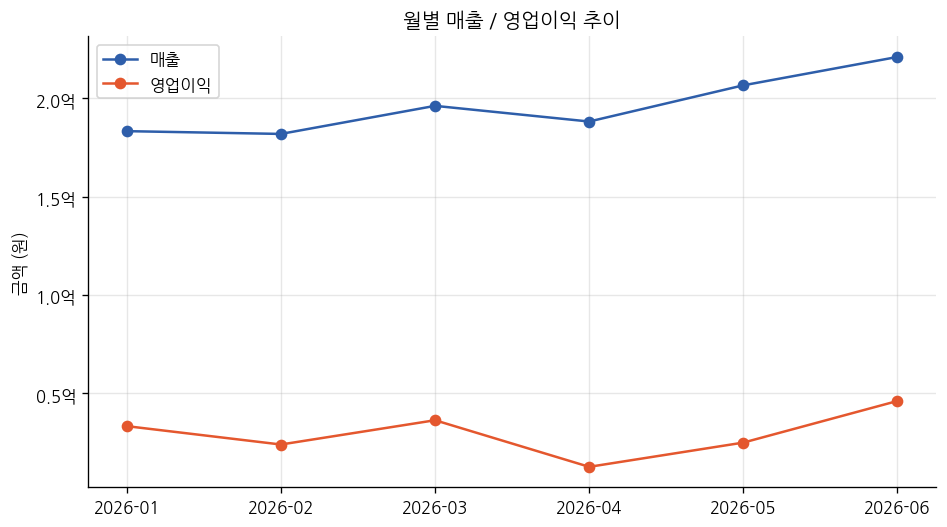
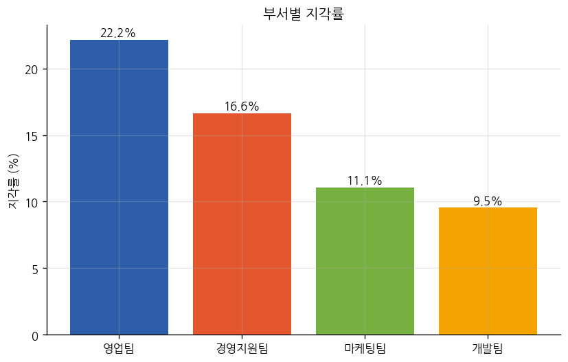
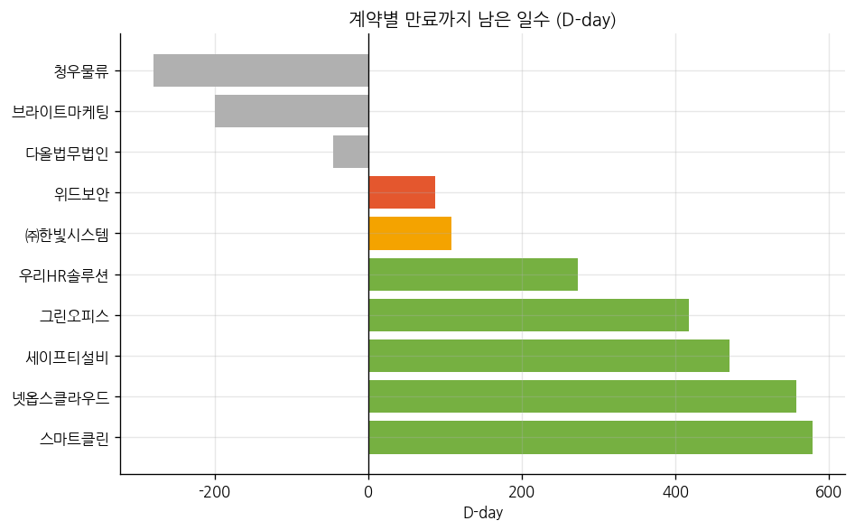

# biz-support-toolkit

[](https://colab.research.google.com/github/Dubong-hedgehog/Management-ToolKit/blob/main/notebooks/finance_demo.ipynb)   < -- 조작예시

경영지원팀(회계·재무 / 인사·총무 / 구매·계약)에서 반복적으로 발생하는 업무를
자동화하는 Python 스크립트 모음입니다.
실제 사내 프로세스를 일반화된 로직으로 만들고 데이터는 샘플 데이터를 붙여놓은 상태로
**클론 후 바로 실행하면 결과(엑셀 리포트, 차트)를 눈으로 확인**할 수 있도록 만들었습니다.

> 모든 데이터는 샘플 데이터로 실 회사의 데이터와 관계 없습니다.
> 계정과목/컬럼명 등 회사 맞춤형으로 변경하여 운영 가능.


## 예제

| 카테고리 | 스크립트 | 하는 일 |
|---|---|---|
| [`finance/`](finance) | `income_statement_generator.py` | 월별 거래 내역 → 간이 손익계산서 + 매출/영업이익 추이 차트 |
| [`hr/`](hr) | `attendance_dashboard.py` | 출퇴근 기록 → 부서별 지각률/초과근무 집계 + 그래프 |
| [`procurement/`](procurement) | `contract_expiry_tracker.py` | 계약 현황 → 만료 임박 계약 강조 리포트 + D-day 차트 |

### 실행 결과 미리보기

**회계/재무 — 매출·영업이익 추이**



**인사/총무 — 부서별 지각률**



**구매/계약 — 계약 만료 D-day**



## 시작하기

```bash
git clone <이 저장소 주소>
cd Management ToolKit
pip install -r requirements.txt

# 예제 1: 손익계산서
python finance/income_statement_generator.py

# 예제 2: 근태 대시보드
python hr/attendance_dashboard.py

# 예제 3: 계약 만료 트래커
python procurement/contract_expiry_tracker.py --warn-days 90
```

각 스크립트는 `sample_data/` 안의 가짜 데이터로 바로 실행되며, 결과는 같은
카테고리 폴더의 `output/`에 저장됩니다. 실제 데이터로 돌리고 싶다면 `--input`
옵션으로 파일 경로만 바꿔주면 됩니다 (컬럼 이름은 각 스크립트 상단 docstring
참고).

## 폴더 구조

```
biz-support-toolkit/
├── common/              # 카테고리 전반에서 재사용하는 유틸 (엑셀 IO, 차트 스타일, 포맷팅)
├── finance/             # 회계·재무 업무
│   ├── sample_data/
│   ├── output/          # 실행 시 생성 (git에는 포함 안 함)
│   └── income_statement_generator.py
├── hr/                  # 인사·총무 업무
│   ├── sample_data/
│   ├── output/
│   └── attendance_dashboard.py
├── procurement/         # 구매·계약 업무
│   ├── sample_data/
│   ├── output/
│   └── contract_expiry_tracker.py
├── docs/screenshots/    # README용 결과 미리보기 이미지 (고정 보관)
├── CONVENTIONS.md       # 새 스크립트/카테고리 추가 시 지키는 규칙
└── requirements.txt
```

## 앞으로 추가 예정인 카테고리

지금은 세 카테고리로 시작하지만, 경영지원팀 업무 전 영역(총무 비품관리,
법무/계약 검토, 세무 신고 보조, 채용/온보딩 등)을 순차적으로 채워나갈
예정입니다. 카테고리가 늘어날 때마다 [`CONVENTIONS.md`](CONVENTIONS.md)에
규칙을 함께 업데이트합니다.

## 기여/확장 규칙

새 스크립트를 추가하기 전에 [`CONVENTIONS.md`](CONVENTIONS.md)를 먼저
확인해주세요. (폴더 구조, 코드 스타일, 샘플 데이터 규칙 등)
