# biz-support-toolkit

경영지원팀(회계·재무 / 인사·총무 / 구매·계약 / 법무) 실무 자동화를 위한 파이썬 스크립트 모음
모든 스크립트는 뼈대가 아니라 가상의 샘플 데이터가 함께 들어 있어 clone 후 명령어 한 줄이면
실제 결과물을 바로 확인할 수 있도록 세팅했습니다.

// 모든 데이터는 가상의 값으로 회사별 데이터 구조에 맞춰 커스텀 필요.

## 카테고리 & 스크립트

| 카테고리 | 스크립트 | 설명 | 실행 명령 |
|---|---|---|---|
| finance | `income_statement_generator.py` | 월별 손익계산서 생성 + 전기 대비 증감 분석 | `python finance/income_statement_generator.py` |
| finance | `financial_statements_pdf.py` | 손익계산서·재무상태표를 공식 서식 PDF로 출력 | `python finance/financial_statements_pdf.py` |
| hr | `attendance_dashboard.py` | 부서별 지각률/초과근무를 원하는 기간(년/반기/분기/월/주)으로 비교 | `python hr/attendance_dashboard.py` |
| hr | `attendance_pattern_analysis.py` | 개인별 지각 "이번달 vs 지난달" 경고/개선 추적 + 부서 이상치 + 근로복지공단 과로사 인정기준 기반 야근 위험도 단계(지각과 별개 지표) | `python hr/attendance_pattern_analysis.py` |
| hr | `build_fit_profile.py` | 과거 재직자(장기재직 vs 조기퇴사) 이력서를 학습해 "회사 핏" 프로파일 생성 | `python hr/build_fit_profile.py` |
| hr | `resume_fit_report.py` | 신규 지원자 이력서 → 적합도 분석 PDF 리포트 자동 생성 (Claude API 연동) | `python hr/resume_fit_report.py` |
| procurement | `contract_wbs_tracker.py` | 계약 전~종료 단계 WBS 관리, 보증보험/실적증명서 체크, 만료 임박 알림(D-30/D-60) | `python procurement/contract_wbs_tracker.py` |
| procurement | `vendor_purchase_analysis.py` | 구매처별 ABC/파레토 분석, HHI 집중도, 가격 급등 탐지 | `python procurement/vendor_purchase_analysis.py` |
| general_affairs | `asset_lifecycle_tracker.py` | 비품/소모품/고정자산/법인차량 통합 자산관리(구매~폐기~승계, 보험 갱신 알림) | `python general_affairs/asset_lifecycle_tracker.py` |
| general_affairs | `safety_training_tracker.py` | 법정의무교육 이수현황(부서별/개인별), 미이수자 알림 | `python general_affairs/safety_training_tracker.py` |
| general_affairs | `general_affairs_ledger.py` | 임대차·용역계약, 문서·인장 관리, 행사·복리후생 통합 관리대장 | `python general_affairs/general_affairs_ledger.py` |
| legal | `contract_document_registry.py` | 계약서 원본(하드본/소프트본) 보관현황 + 필수조항 체크 매트릭스 | `python legal/contract_document_registry.py` |


옵션 없이 실행하면 전부 `sample_data/`의 샘플 데이터로 동작합니다. `--input` 등 argparse 옵션으로
실제 데이터 경로를 넘기면 그대로 재사용할 수 있습니다.

## 채용 A to Z: AI 기반 적합도 분석 파이프라인

`hr/` 폴더의 채용 관련 스크립트 3개는 아래 순서로 이어지는 하나의 파이프라인입니다.

1. **과거 재직자 이력서 학습** — `hr/sample_data/past_hires_resumes.csv`에는 "장기재직(긍정패턴)"
   그룹뿐 아니라 "조기퇴사(위험패턴, 6개월 이내 퇴사)" 그룹도 함께 들어 있습니다. 장기재직자만
   보면 "이미 뽑힌 사람들은 원래 비슷하다"는 생존편향에 빠지기 쉬워서, 조기퇴사 사례의 공통점도
   대비군으로 함께 학습합니다.
2. **8개 범용 핏 카테고리로 분류** — `hr/fit_taxonomy.py`에 정의된 전문성_실행력, 커뮤니케이션,
   협업_팀워크, 멀티태스킹_적응력, 리더십_주도성(업무 역량)과 대외활동_네트워킹, 커뮤니티_봉사활동,
   학습민첩성_성장지향(인간적 측면)까지 아우릅니다. 카테고리/키워드는 전부 "이력서에 서술된
   행동·경험" 기준이며 성별·나이·출신학교 등 인적 속성은 다루지 않습니다.
3. **학습 결과 저장** — `python hr/build_fit_profile.py`를 실행하면 `hr/output/company_fit_profile.json`
   으로 저장됩니다. (`.env`는 API 키 같은 설정값 전용이고, 실제로 "학습된" 데이터는 이 JSON
   파일입니다.)
4. **신규 지원자 리포트 생성** — `python hr/resume_fit_report.py`를 실행하면 지원자 이력서와
   회사 핏 프로파일을 비교해서 카테고리별 점수, 종합 의견(추론), 면접 중점 포인트, 맞춤 면접
   질문이 담긴 PDF가 `hr/output/`에 생성됩니다.

`.env`에 `ANTHROPIC_API_KEY`를 설정하면 2/4단계에서 Claude가 이력서 원문을 직접 읽고 정성
평가와 맞춤 질문을 생성합니다. 키가 없으면 `fit_taxonomy.py`의 키워드 사전으로 자동
대체(폴백)되어 항상 결과가 나옵니다 — 정교함은 떨어지지만 API 키 없이 clone해도 파이프라인이
끝까지 동작합니다.

> 다음 단계(로드맵): 실 면접에서 나온 질문/답변을 음성-텍스트 변환해 최종 적합도에 반영하는
> 5단계는 아직 구현 전입니다.
>
> ⚠️ 이 리포트들은 참고 자료입니다. "재직중=핏 좋음 / 조기퇴사=핏 안 좋음"은 편의상의 근사치일
> 뿐 확정적 인과관계가 아니며(조직·상사·처우 문제로 퇴사했을 수도 있음), 최종 채용 판단을 이
> 결과 하나로 내리면 안 됩니다.

## 실행 결과 미리보기

**finance**


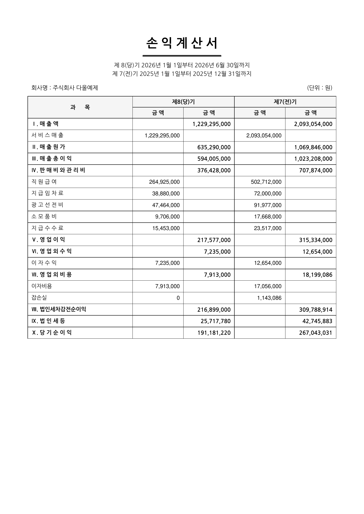

**hr — 근태**

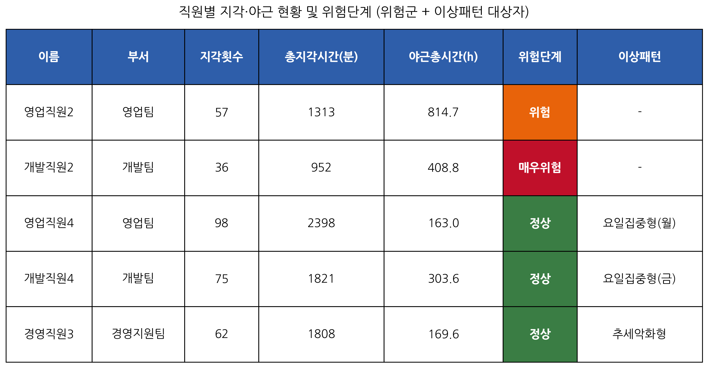
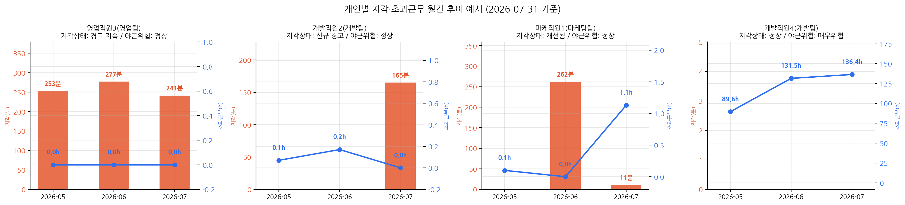

**hr — 채용 A to Z**

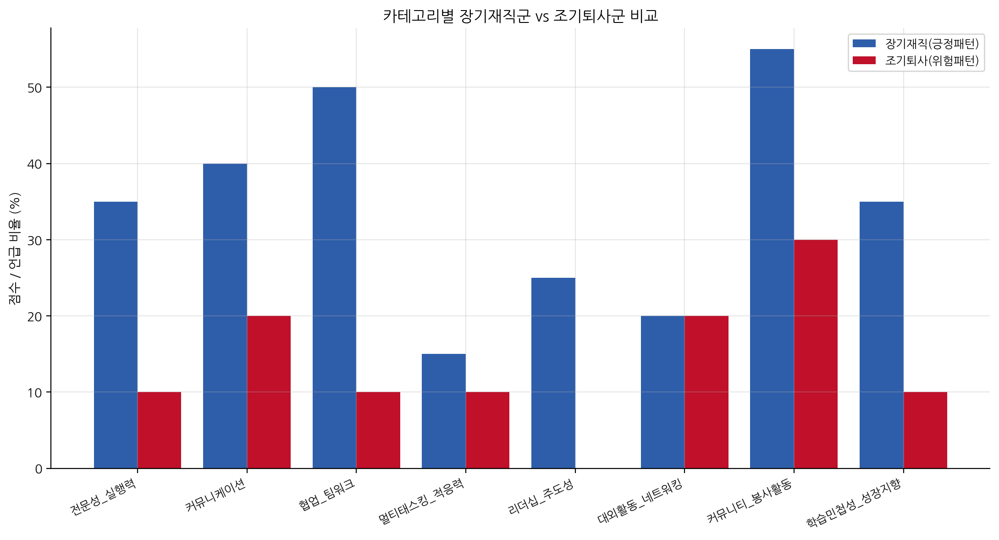
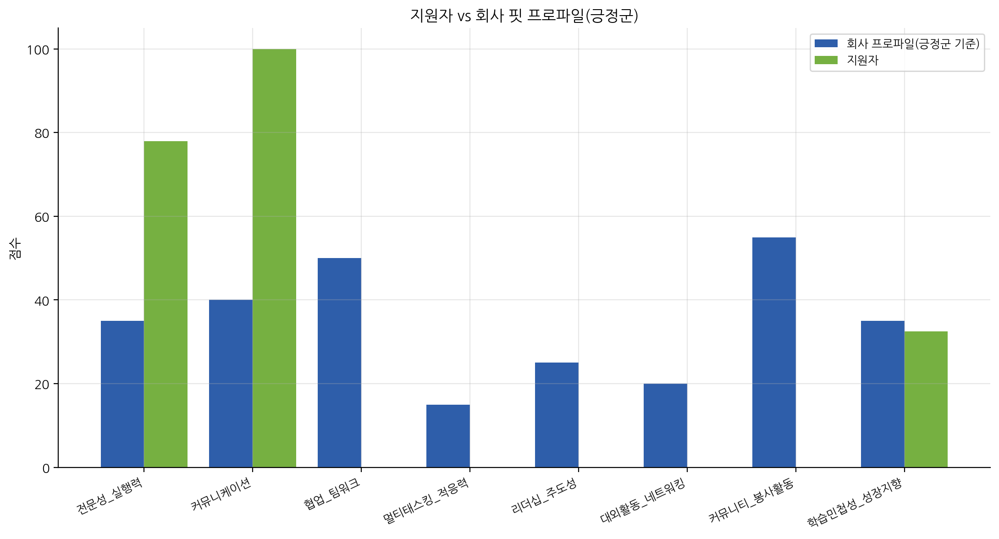
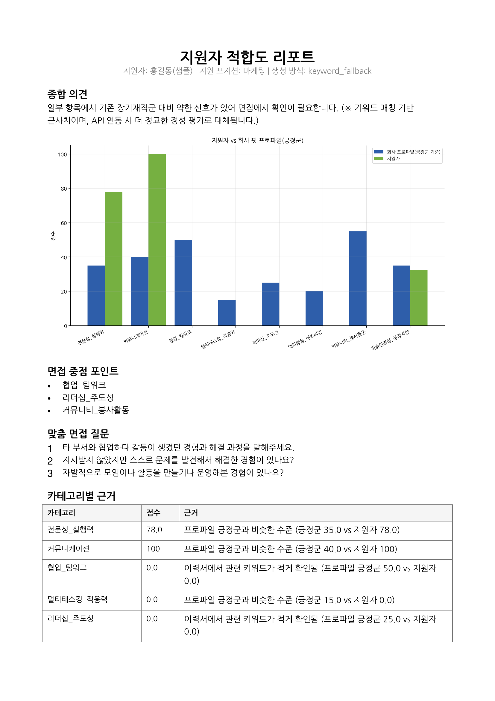

**procurement**

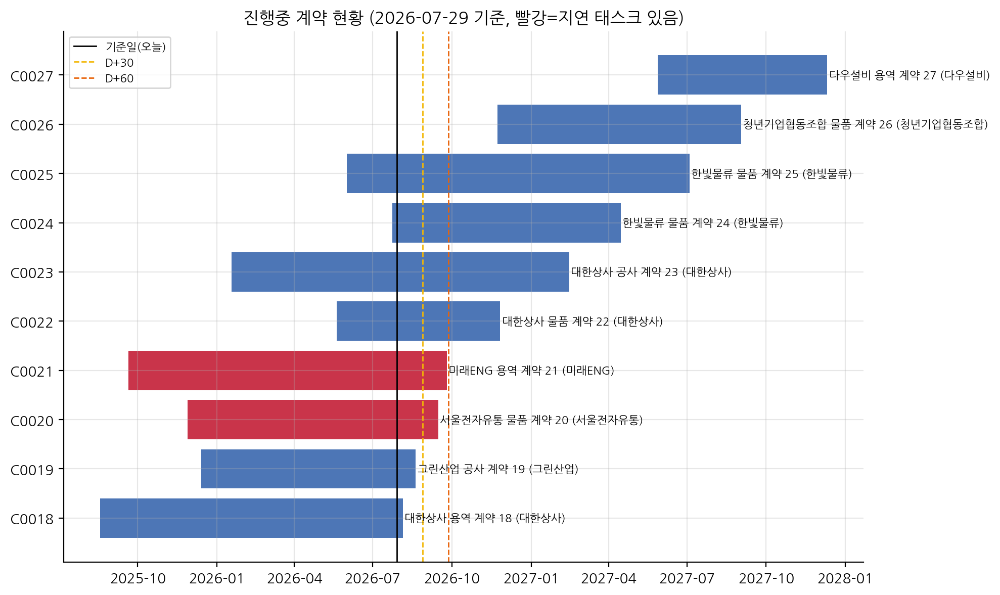
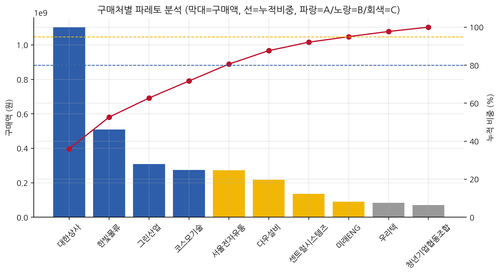

**general_affairs**

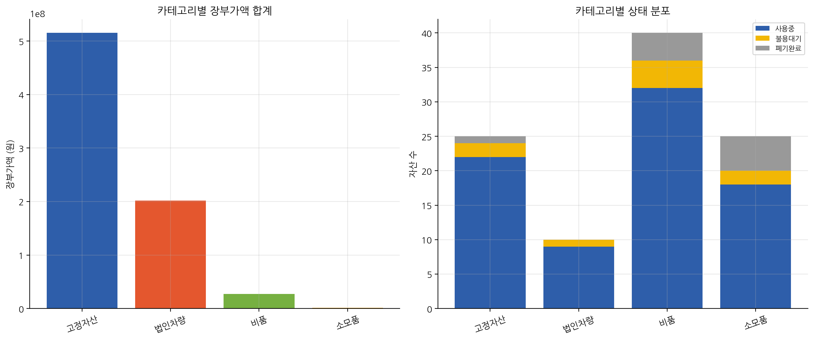
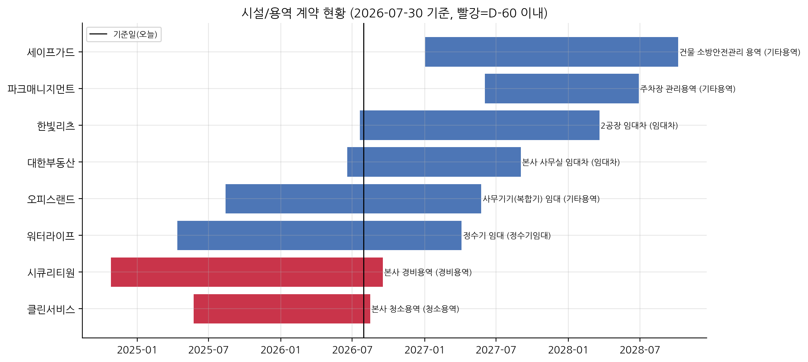
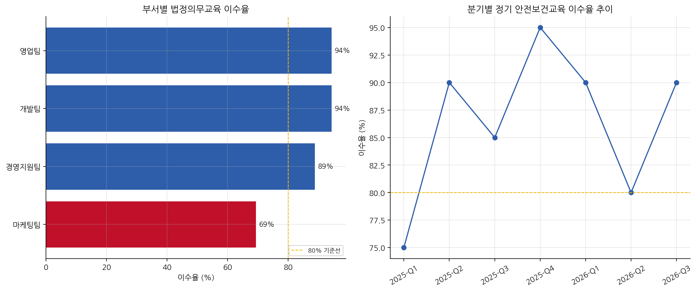

**legal**

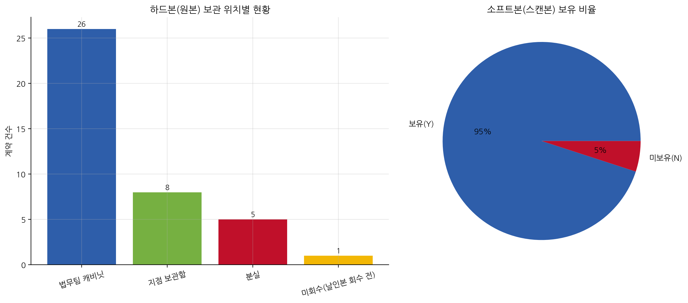
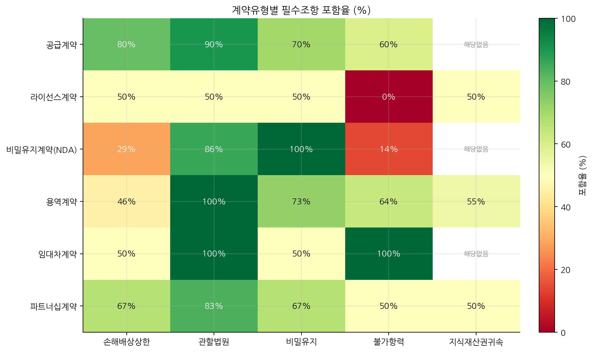

## Claude API 연동 (선택)

일부 스크립트(`hr/build_fit_profile.py`, `hr/resume_fit_report.py`)는 Claude API를 선택적으로
사용합니다.

```
# .env
ANTHROPIC_API_KEY=sk-ant-...
ANTHROPIC_MODEL=claude-sonnet-5   # 생략 시 기본값
```

키를 설정하지 않아도 스크립트는 정상적으로 끝까지 실행됩니다(키워드 기반 폴백). 실제로 API를
호출하면 사용자 본인의 Anthropic API 사용량에 따라 비용이 발생합니다 — 이 저장소가 비용을
대신 부담하지 않습니다.

## 시작하기

```bash
git clone <this-repo>
cd biz-support-toolkit
pip install -r requirements.txt

python finance/income_statement_generator.py
python finance/financial_statements_pdf.py
python hr/attendance_dashboard.py
python hr/attendance_pattern_analysis.py
python hr/build_fit_profile.py
python hr/resume_fit_report.py
python procurement/contract_wbs_tracker.py
python procurement/vendor_purchase_analysis.py
python general_affairs/asset_lifecycle_tracker.py
python general_affairs/safety_training_tracker.py
python general_affairs/general_affairs_ledger.py
python legal/contract_document_registry.py
```

코드 없이 결과만 눌러보고 싶다면 `notebooks/finance_demo.ipynb`를 Colab에서 열어보세요.
(다른 카테고리용 Colab 노트북은 아직 준비 중입니다.)

## 폴더 구조

```
biz-support-toolkit/
├── common/                     # 공통 유틸(엑셀 입출력, 차트 스타일, 포맷팅, 기간 계산,
│                                #  세금 추정, 시트 연동, PDF 렌더링, 알림, Claude API)
│   ├── chart_style.py
│   ├── excel_io.py
│   ├── format_utils.py
│   ├── llm_utils.py
│   ├── notify_utils.py
│   ├── pdf_statement.py
│   ├── period_utils.py
│   ├── sheet_io.py
│   └── tax_utils.py
├── finance/
│   ├── sample_data/
│   ├── income_statement_generator.py
│   └── financial_statements_pdf.py
├── hr/
│   ├── sample_data/
│   │   └── generate_attendance_sample.py
│   ├── output/
│   ├── attendance_dashboard.py
│   ├── attendance_pattern_analysis.py
│   ├── fit_taxonomy.py
│   ├── build_fit_profile.py
│   └── resume_fit_report.py
├── procurement/
│   ├── sample_data/
│   ├── contract_wbs_tracker.py
│   └── vendor_purchase_analysis.py
├── general_affairs/
│   ├── sample_data/
│   ├── asset_lifecycle_tracker.py
│   ├── safety_training_tracker.py
│   └── general_affairs_ledger.py
├── legal/
│   ├── sample_data/
│   └── contract_document_registry.py
├── notebooks/
│   └── finance_demo.ipynb
├── docs/screenshots/
├── requirements.txt
└── CONVENTIONS.md
```
